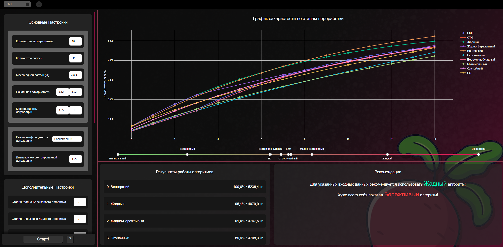

# Лабораторная работа по численным методам

### Введение

В данной лабораторной работе рассматривается задача о назначениях, а именно её модифи кация- нечёткая задача о назначениях, возникающая при планировании переработки сахарной свеклы. 

**Целью** данной работы является создание СППР (Система Поддержки Принятия Решений), которая позволила бы производить оценку эффективности различных эвристических стратегий в заданных условиях

---
### Состав команды

- **Кутузов Иван;**
- **Лузан Егор;**
- **Максим Поташник;**
- **Алексей Завьялов**;
- **Гонозов Леонид**;

---
### Результат работы

Внешний вид программы:

**Основные особенности интерфейса программы:**

* Реализована возможность изменения масштаба путём нажатия сочетаний клавиш "ctrl −" и "ctrl shift =".

* Есть возможность создания вкладок- можно параллельно иметь несколько вариантов входных данных и переключаться между результатами простой сменой вкладки; 

* Также потянув за фиолетовые границы между блоками можно изменять их пропорции. Например, выделить больше места на график.

[Правила работы в репозитории](Rules.md)